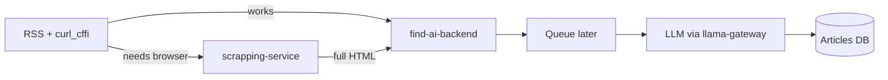
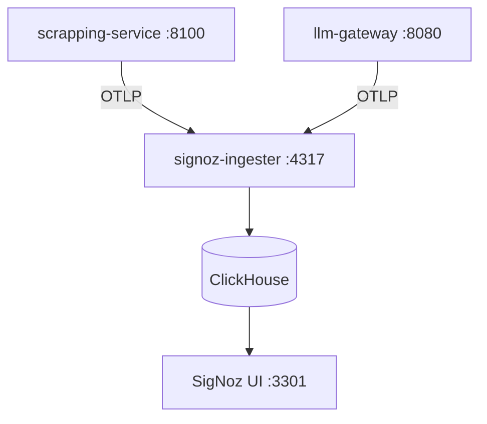

# Phase 2.7.0 — Architecture

## Separation of concerns

```
FinBro/
  scrapping-service/     # CloakBrowser scrape API only
    scripts/             # scrape start/stop/deploy
  llm-gateway/           # OTEL proxy in front of llama.cpp
    scripts/             # llama start/stop
  observability/         # shared monitoring (not owned by one app)
    signoz/
    uptime-kuma/
  find-ai-backend/       # news + courses + auth (Oracle / primary API)
```

Each runtime service owns its scripts. Shared infra lives under `observability/`.

## Target news enrichment flow



**Today:** scraper is standalone; backend still uses inline scrape + LLM in `core/scheduler.py`.  
**Next:** backend tries `curl_cffi` first; on empty/fail, `POST` to scraping service; eventually LLM reads a queue.

## Scraping service

### Responsibility

Given URL(s) → open CloakBrowser → wait full load → settle 2s → scroll → settle 2s → return **complete rendered HTML**. No extraction.

### Endpoints

| Method | Path | Notes |
|--------|------|-------|
| `GET` | `/health` | Liveness / SigNoz + monitors |
| `POST` | `/scrape` | `{ "url" }` or `{ "urls": [...] }` max 5 |
| `GET` | `/traffic` | Local in/out request log UI |
| `GET` | `/traffic/events` | JSON feed for that UI |

Auth: optional `X-API-Key` from `.env`.

### Tab manager

- One Chrome window: `browser.new_context()` + `context.new_page()` per URL
- Batches of `max_tabs` (default 5)
- `networkidle` with fallback to `load` (TOI-style perpetual ads)

### Deploy

- Host: Tailscale `100.64.0.1`, user `phinex`
- User systemd: `scrapping-service.service` → uvicorn `:8100`
- Scripts: `scrapping-service/scripts/{start,stop,restart,status,deploy}.sh`
- Host aliases: `~/bin/scrape-*`

## LLM gateway

```
Public :8080 (llm-gateway + OTEL)
        ↓
127.0.0.1:18080 (llama-server --metrics)
```

- Streaming reverse proxy (httpx) preserves chat completions
- OTEL service name: `llama-server`
- Scripts: `llm-gateway/scripts/llama-{start,stop,restart,status}.sh`
- Host aliases: `~/bin/llama-*`

## Observability (SigNoz)

| Port | Role |
|------|------|
| 3301 | SigNoz UI (8080 taken by LLM) |
| 4317 | OTLP gRPC |
| 4318 | OTLP HTTP |



- Install via Foundry → `~/signoz/pours/deployment`
- Compose UI port remapped `3301:8080`
- OpenTelemetry instrumentation:
  - FastAPI instrumentor (avoid `BaseHTTPMiddleware` — breaks spans)
  - Custom spans: `scrape.batch`, `scrape.fetch`, `llama.proxy`
- Scripts: `observability/signoz/{install,start,stop,restart,status}.sh`
- Host aliases: `~/bin/signoz-*`

Uptime Kuma (`:3001`) remains optional for simple up/down; SigNoz is the request observability tool.

## Host notes (archcraft)

- Non-interactive SSH `PATH` is only `/usr/share/archcraft/scripts` — all scripts must `export PATH=/usr/bin:/bin:...`
- Use absolute paths (`/bin/tar`, `/bin/mkdir`) for remote ops
- Do not use `rsync` unless remote `PATH` includes it; prefer tar-over-ssh
